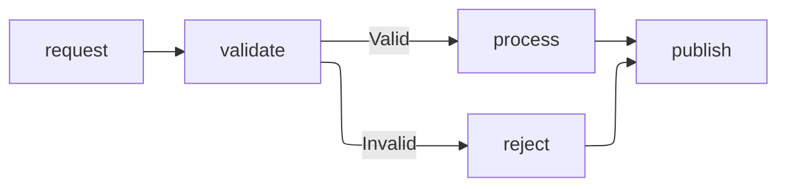

# Use ELK Layout for Complex Flowcharts

## Context

Small, mostly linear Mermaid flowcharts are typically readable with any commonly supported layout, but larger flowcharts often contain multiple branches, cross-links, and nested subgraphs. In these diagrams, poor node placement and unnecessary edge crossings can obscure the relationships that the diagram is intended to communicate.

The Eclipse Layout Kernel (ELK) layout is designed to arrange larger and more complex graphs. Mermaid supports selecting it explicitly with `layout: elk`, although availability and default layout behavior vary between Mermaid versions and builds.

## Decision

We will use the ELK layout for complex Mermaid flowcharts. A flowchart is complex when its branching, cross-links, or nested subgraphs make the default rendering difficult to follow.

We will select ELK explicitly in the diagram configuration so that the intended layout does not depend on a Mermaid version's default:

We may keep the renderer's default layout for simple flowcharts when it produces a clear result. We will visually verify ELK diagrams with `mmdc` and ensure that they remain readable in the other supported renderers.

## Consequences

Positive consequences:

- Complex flowcharts have clearer node placement and fewer distracting edge crossings.
- Explicit configuration preserves the author's layout intent when Mermaid defaults change.
- Authors retain a simpler source and rendering path for small flowcharts that do not benefit from ELK.

Negative consequences:

- Authors must use judgment to decide when a flowchart is complex enough to require ELK.
- ELK can produce a larger diagram or a layout that differs from the source declaration order.
- Mermaid versions or builds without ELK support may fall back to another layout, so output still requires cross-renderer verification.
- Explicit layout configuration adds boilerplate to affected diagram sources.

## Alternatives Considered

**Use ELK for every flowchart**. This creates one layout rule and may improve complex diagrams, but it adds configuration where it offers little value and can produce less predictable results for small diagrams.

**Always use the renderer's default layout**. This minimizes configuration, but the default can vary by Mermaid version or build and does not clearly record the intended layout algorithm.

**Use Dagre for complex flowcharts**. Dagre is widely supported and works well for straightforward layered graphs, but ELK generally provides better placement for graphs with extensive branching, cross-links, or nested subgraphs.
